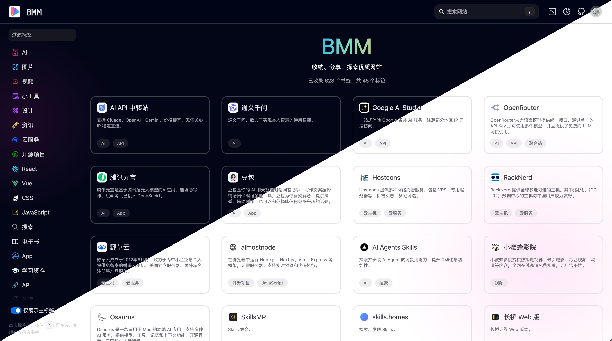
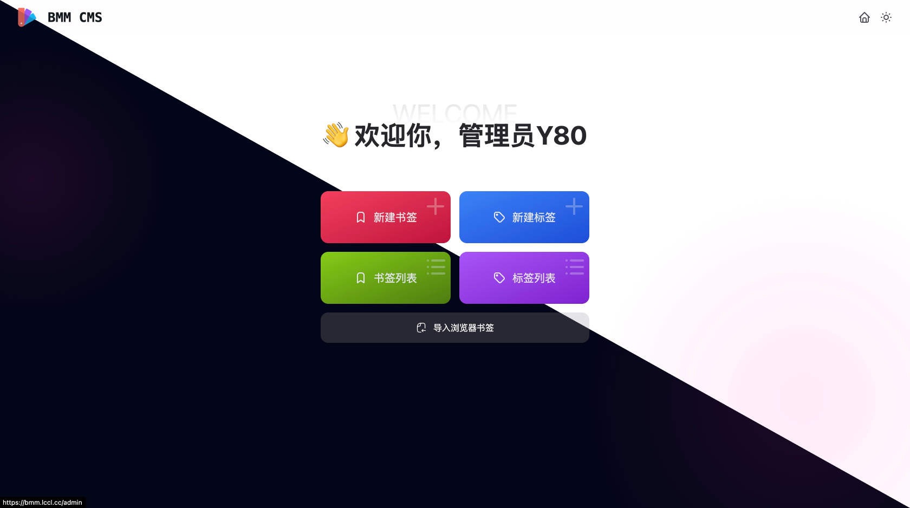
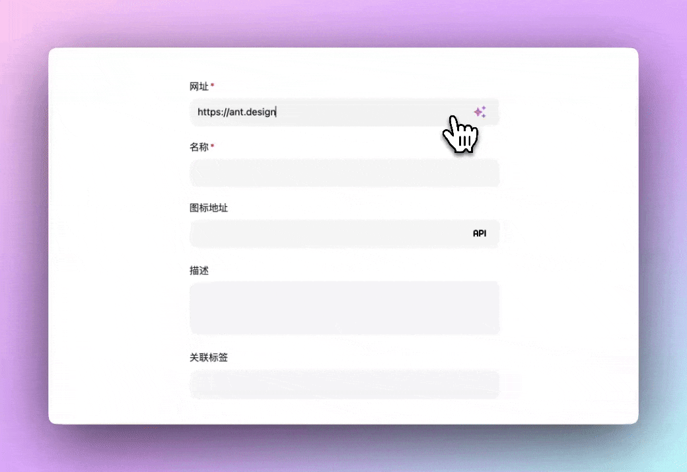
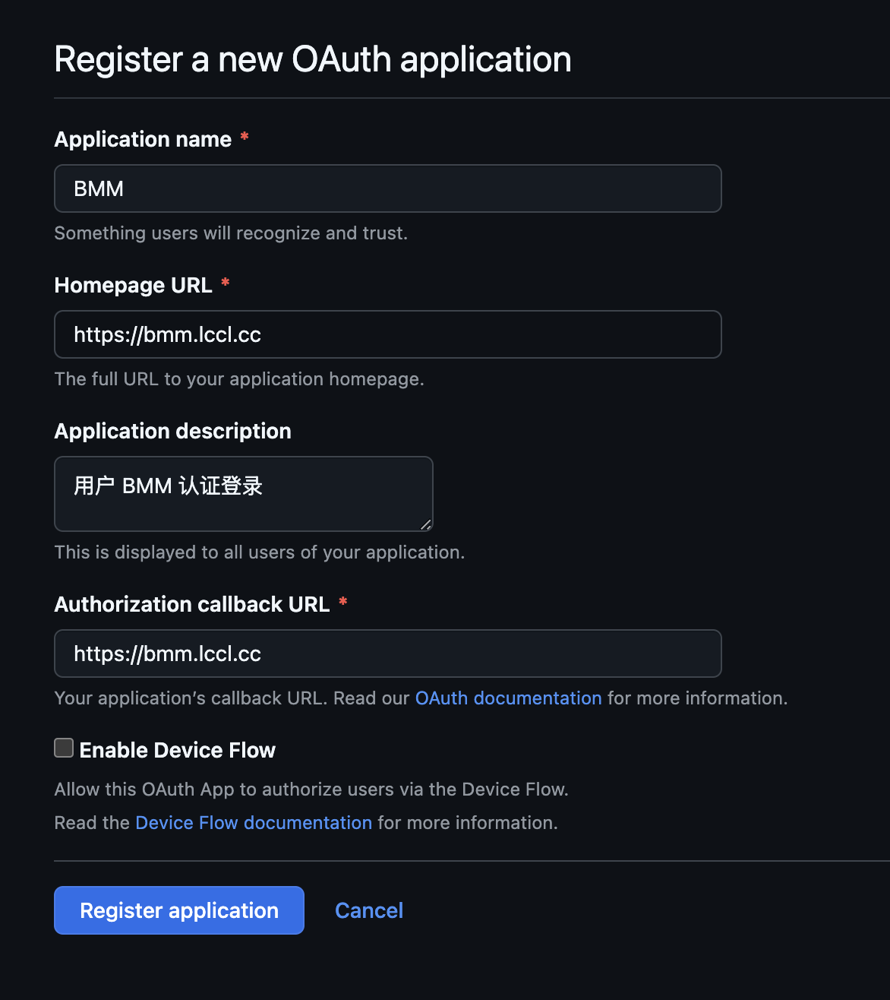
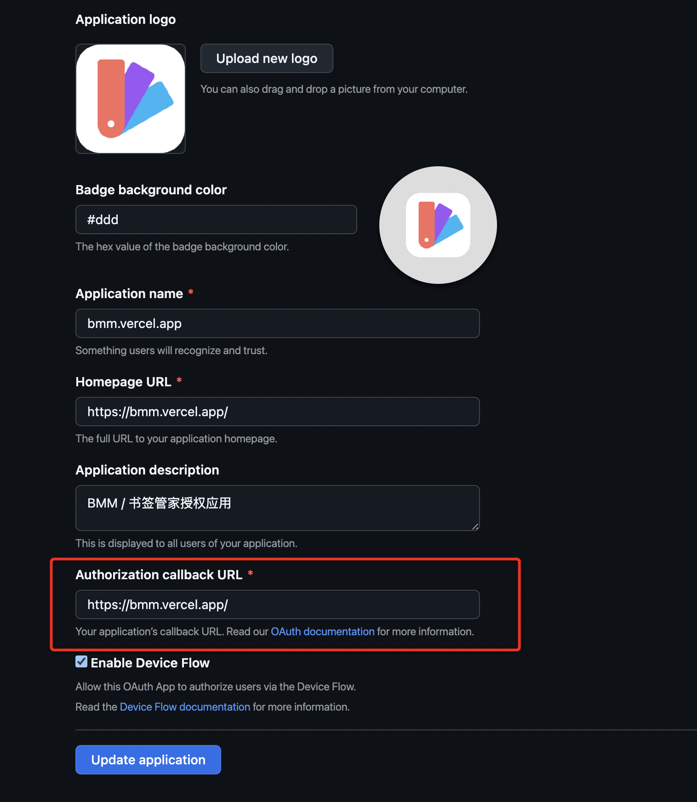
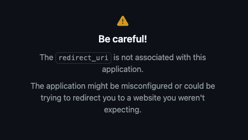

<div align="center">
  
  <h1>BMM</h1>
  <p>An open-source full-stack app for collecting, organizing, searching, and sharing website bookmarks.</p>
  <p>Built for personal and team use, with a public showcase, user workspace, admin tools, and AI-assisted bookmark workflows.</p>
  <p>
    <a href="https://bmm.lccl.cc/" target="_blank">Live Demo</a> ·
    <a href="https://github.com/Y80/bmm" target="_blank">GitHub</a> ·
    <a href="#quick-start">Quick Start</a>
  </p>
  <p>
    
    
    
    
    
  </p>
</div>

<!-- README-I18N:START -->

[简体中文](./README.md) | **English**

<!-- README-I18N:END -->

<div align="center">
  
  
  
  
</div>

<a id="overview"></a>

## Overview

BMM is an open-source application for managing website bookmarks. It combines collecting links, organizing them with tags, publishing curated websites, and maintaining the data from an admin interface in one system, with automatic metadata fetching and AI-assisted entry flows.

You can use it as:

- a personal bookmark dashboard
- a team knowledge directory
- a public website curation portal

<a id="highlights"></a>

## Highlights

- Public pages, user workspaces, and admin tools live in the same product, so you can grow from personal use to a shared navigation site.
- Browser bookmark exports can be imported and mapped into tag relationships, which makes migration easier.
- Supports many-to-many tag and bookmark relations, drag-and-drop sorting, keyword search, and pinyin search.
- Automatically fetches website titles, descriptions, and icons, with extra probing for common icon paths.
- Supports both GitHub OAuth and email/password authentication.
- Uses AI to analyze websites, suggest tags, and generate related-tag suggestions and theme colors.
- Responsive UI works across desktop and mobile, with light and dark themes.

<a id="roadmap"></a>

## Planned Features

- [ ] Multi-purpose cards such as weather and news
- [ ] Browser extension
- [ ] Bookmark availability checks
- [ ] Read-it-later workflow

<a id="stack"></a>

## Tech Stack

| Category | Technology |
| --- | --- |
| Framework | [Next.js 16](https://nextjs.org/) + React 19 |
| Language | [TypeScript](https://www.typescriptlang.org/) |
| Styling | [Tailwind CSS 4](https://tailwindcss.com/) |
| UI | [HeroUI](https://heroui.com/) + [Ant Design](https://ant.design/) |
| Database | SQLite / PostgreSQL / Turso |
| ORM | [Drizzle ORM](https://orm.drizzle.team/) |
| Auth | [NextAuth v5 beta](https://authjs.dev/) |
| AI | [Vercel AI SDK](https://sdk.vercel.ai/) + OpenAI-compatible provider |
| Testing | [Vitest](https://vitest.dev/) |

<a id="quick-start"></a>

## Quick Start

### Requirements

- [Node.js](https://nodejs.org/) >= 24.0.0
- [pnpm](https://pnpm.io/) >= 10.24.0

> [!TIP]
> Local startup uses SQLite by default. `pnpm dev`, `pnpm build`, and `pnpm start` all run the database bootstrap script first, so manual database setup is usually unnecessary.

### Local Development

```bash
git clone https://github.com/Y80/bmm.git
cd bmm
pnpm install
pnpm dev
```

Then open `http://localhost:3000`.

<a id="scripts"></a>

## Common Commands

| Command | Description |
| --- | --- |
| `pnpm dev` | Start the development server and initialize the database first |
| `pnpm build` | Build for production |
| `pnpm start` | Run the production build |
| `pnpm lint` | Run ESLint |
| `pnpm test` | Run Vitest |
| `pnpm db:test` | Check database connectivity |
| `pnpm db:migrate` | Generate and apply database migrations |
| `pnpm db:push` | Push schema changes directly and may risk data loss |
| `pnpm studio` | Open Drizzle Studio |

<a id="env"></a>

## Environment Variables

See [`.env`](./.env) for the full example.

> [!TIP]
> If you only want to get the app running, local development usually works with the default SQLite configuration. AI features and GitHub login are optional add-ons.

| Variable | Purpose |
| --- | --- |
| `DB_DRIVER` | Database driver, `sqlite` or `postgresql` |
| `DB_CONNECTION_URL` | Database connection string |
| `DB_AUTH_TOKEN` | Optional token for Turso or libsql |
| `AUTH_URL` | Current site URL used by auth and deployment flows |
| `AUTH_SECRET` | NextAuth secret, recommended for production |
| `AUTH_GITHUB_ID` | Optional GitHub OAuth Client ID |
| `AUTH_GITHUB_SECRET` | Optional GitHub OAuth Client Secret |
| `OPENAI_API_KEY` | Optional AI provider key |
| `OPENAI_BASE_URL` | Optional OpenAI-compatible base URL |
| `OPENAI_MODEL` | Optional AI model name |

<a id="database"></a>

## Database

BMM currently supports SQLite, PostgreSQL, and Turso directly.

- SQLite is the default local option, and the database file is initialized automatically on first run.
- To switch to PostgreSQL or Turso, update `DB_DRIVER` and `DB_CONNECTION_URL`.
- The repository includes [`docker-compose.yml`](./docker-compose.yml) as a PostgreSQL deployment example.

If you only want to verify database readiness, run:

```bash
pnpm db:test
pnpm db:migrate
```

<a id="deployment"></a>

## Deployment

### Node Deployment

```bash
git clone https://github.com/Y80/bmm.git
cd bmm
pnpm install
pnpm build
pnpm start
```

### Docker Deployment

The repository includes a ready-to-use [`Dockerfile`](./Dockerfile). The example below uses SQLite with a mounted volume:

```bash
docker build -t bmm .

docker run --rm \
  -e DB_DRIVER=sqlite \
  -e DB_CONNECTION_URL=file:/app/volume/sqlite.db \
  -v bmm:/app/volume \
  -p 3000:3000 \
  bmm
```

### Vercel Deployment

1. Fork this repository and import it into Vercel.
2. Configure database, auth, and optional AI variables in Environment Variables.
3. After deployment, verify that `AUTH_URL` matches the GitHub OAuth callback URL.

<a id="ai"></a>

## AI Integration

The AI features reduce manual work during bookmark entry and organization. Current coverage includes:

- automatic website title, description, and icon analysis
- related tag suggestions for bookmarks
- related-tag suggestions and theme colors for tags

The project uses Vercel AI SDK with an OpenAI-compatible provider. A typical configuration looks like:

```bash
OPENAI_API_KEY=sk-xxxxxxxxxxxxxxxx
OPENAI_BASE_URL=https://api.deepseek.com/v1
OPENAI_MODEL=deepseek-chat
```

Supported options include OpenAI-compatible providers such as OpenAI, DeepSeek, Moonshot, and GLM. For non OpenAI-compatible services, refer to [AI SDK Providers](https://ai-sdk.dev/providers/ai-sdk-providers).

<a id="oauth"></a>

## GitHub OAuth Setup

> [!IMPORTANT]
> `AUTH_URL`, the GitHub OAuth App `Authorization callback URL`, and the actual URL users use to access BMM must match exactly.

1. Create a GitHub OAuth App at <https://github.com/settings/applications/new>.
2. Set the callback URL in the form `https://your-domain.com/api/auth/callback/github`.
3. Configure these variables:

```bash
AUTH_GITHUB_ID=your-client-id
AUTH_GITHUB_SECRET=your-client-secret
AUTH_URL=https://your-domain.com
```

These screenshots can help when checking the configuration:





<a id="faq"></a>

## FAQ

<details>
<summary>What should <code>AUTH_URL</code> be?</summary>

<br>

It should equal the real URL users open BMM with, for example:

- `http://localhost:3000`
- `https://bmm.vercel.app`
- `https://example.com`
- `http://10.1.2.3:3000`

</details>

<details>
<summary>What if GitHub login fails with a <code>redirect_uri</code> error?</summary>

<br>

Check whether these three values are exactly the same:

- the GitHub OAuth App `Authorization callback URL`
- the `AUTH_URL` environment variable
- the actual BMM access URL

Example error screenshot:



</details>

<details>
<summary>What if the callback URL becomes wrong after changing the port or using an IP address?</summary>

<br>

Whenever the access URL changes, update both `AUTH_URL` and the callback URL in the GitHub OAuth App.

</details>

<details>
<summary>Are more databases supported?</summary>

<br>

This repository directly implements SQLite / PostgreSQL / Turso. Because it uses Drizzle ORM, extending to more databases is feasible, but it still requires the matching schema and driver work.

</details>
