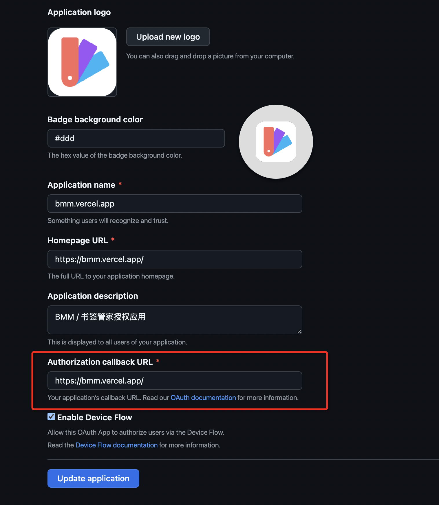

<div align="center">
  
  <br>
  <h1>BMM</h1>
  <p>Collect, Share, and Explore Quality Websites</p>
  <p><i>Bookmark Manager - Your Personal Bookmark Manager</i></p>
  <p>
    <a href="./README.md">🇨🇳 简体中文</a> •
    <a href="https://bmm.lccl.cc/" target="_blank">✨ Live Demo</a> •
    <a href="https://github.com/Y80/bmm" target="_blank">📦 GitHub</a> •
    <a href="#quick-start">🚀 Quick Start</a>
  </p>
  <p>
    
    
    
    
    
  </p>
</div>

---

<div align="center">
  
  
  
  
</div>

---

## 📋 Table of Contents

- [✨ Features](#-features)
- [🛠️ Tech Stack](#️-tech-stack)
- [🚀 Quick Start](#-quick-start)
- [⚙️ Environment Variables](#️-environment-variables)
- [🗄️ Database Configuration](#️-database-configuration)
- [🌍 Deployment](#-deployment)
- [🤖 AI Integration](#-ai-integration)
- [🔐 GitHub OAuth Setup](#-github-oauth-setup)
- [❓ FAQ](#-faq)
- [📄 License](#-license)

---

## ✨ Features

### Basic Features

| Feature | Description |
|---------|-------------|
| 📱 Responsive Design | Mobile/Desktop support with Light/Dark themes |
| 🔍 Smart Search | Pinyin and keyword search for bookmarks and tags |
| 🏷️ Tag Relations | Many-to-many relationships between tags and bookmarks |
| 🔐 Authentication | GitHub OAuth + Email/Password login |
| 👤 User Management | Users can manage their own bookmarks and tags |

### Admin Features

- 📥 **Batch Import** - Import bookmarks from browser exports (HTML/JSON)
- 📝 **CRUD Operations** - Create, read, update, delete tags and bookmarks
- 🔗 **Tag Relations** - Manage relationships between tags
- 📊 **Tag Sorting** - Drag-and-drop tag ordering
- 🕷️ **Metadata Scraping** - Auto-fetch website title, icon, and description
- 🤖 **AI Smart Analysis** - AI auto-extracts website info and recommends tags
- 🎨 **Theme Generation** - AI analyzes tag relations and generates theme colors

### Roadmap

- [ ] Multi-function cards (weather, news, etc.)
- [ ] Browser extension
- [ ] Bookmark availability checking
- [ ] Read-it-later system

---

## 🛠️ Tech Stack

| Category | Technology |
|----------|------------|
| Framework | [Next.js 16](https://nextjs.org/) (App Router) |
| Language | [TypeScript 5](https://www.typescriptlang.org/) |
| Styling | [Tailwind CSS 4](https://tailwindcss.com/) |
| UI Components | [HeroUI](https://heroui.com/) + [Ant Design](https://ant.design/) |
| ORM | [Drizzle ORM](https://orm.drizzle.team/) |
| Database | SQLite / PostgreSQL / Turso |
| Auth | [NextAuth v5](https://authjs.dev/) |
| AI SDK | [Vercel AI SDK](https://sdk.vercel.ai/) |
| Testing | [Vitest](https://vitest.dev/) |

---

## 🚀 Quick Start

### Requirements

- [Node.js](https://nodejs.org/) >= 24.0.0
- [pnpm](https://pnpm.io/) >= 10.24.0

### Local Development

```bash
# 1. Clone repository
git clone https://github.com/Y80/bmm.git
cd bmm

# 2. Install dependencies
pnpm install

# 3. Start dev server
pnpm dev
```

The project will start at `http://localhost:3000` with an auto-created SQLite database.

---

## ⚙️ Environment Variables

See [.env](./.env) for reference.

### Quick Demo

No environment variables needed for local development - SQLite works out of the box.

### Production

Key variables for production:

| Variable | Description |
|----------|-------------|
| `AUTH_URL` | Auth callback URL, must match your deployment URL |
| `DB_DRIVER` | Database driver (sqlite/postgresql) |
| `DB_CONNECTION_URL` | Database connection string |
| `DB_AUTH_TOKEN` | Turso auth token (optional) |

---

## 🗄️ Database Configuration

BMM uses Drizzle ORM with out-of-the-box support for SQLite and PostgreSQL.

### Default (SQLite)

```bash
# Auto-create database file locally
pnpm dev
```

### Production Database

#### Option 1: Turso (Recommended)

- [BMM + Turso Guide](https://github.com/Y80/bmm/wiki/使用-Turso-数据库服务)

#### Option 2: Free PostgreSQL

- [Free PostgreSQL Providers](https://juejin.cn/post/7411047482651951119)

---

## 🌍 Deployment

### Method 1: Node Deployment

```bash
# 1. Clone
git clone https://github.com/Y80/bmm.git
cd bmm

# 2. Install
pnpm install

# 3. Build
pnpm build

# 4. Start (or use PM2)
pnpm start
# or
pm2 start "pnpm start"
```

### Method 2: Vercel

1. **Fork** this repository to your GitHub account
2. Login to [Vercel](https://vercel.com) and create a new project linked to your fork
3. Configure environment variables in the Environment Variables page

   <details>
   <summary>View Screenshot</summary>

   

   **Note**: No `AUTH_URL` needed if using Vercel's auto-assigned domain
   </details>

4. Redeploy the project

### Method 3: Docker

```bash
# Pull image
docker pull lcclcc/bmm

# SQLite mode (use docker volume bmm to locate database file)
docker run --rm \
  -e DB_DRIVER=sqlite \
  -e DB_CONNECTION_URL=file:/app/volume/sqlite.db \
  -v bmm:/app/volume \
  -p 3000:3000 \
  lcclcc/bmm \
  pnpm start

# Turso mode
docker run --rm \
  -e DB_DRIVER=sqlite \
  -e DB_CONNECTION_URL=libsql://your-turso-db-url \
  -e DB_AUTH_TOKEN=<your-turso-token> \
  -p 3000:3000 \
  lcclcc/bmm \
  pnpm start

# PostgreSQL mode
docker run --rm \
  -e DB_DRIVER=postgresql \
  -e DB_CONNECTION_URL=postgresql://your-db-url \
  -p 3000:3000 \
  lcclcc/bmm \
  pnpm start
```

---

## 🤖 AI Integration

AI features significantly reduce bookmark maintenance effort:

- 📝 **Website Analysis** - Auto-extract title, description, icon
- 🏷️ **Smart Tags** - Auto-recommend related tags
- 🎨 **Theme Generation** - Analyze tag relations and theme colors

### Supported AI Services

Any OpenAI-compatible API is supported:

- [OpenAI](https://openai.com/)
- [DeepSeek](https://www.deepseek.com/)
- [Moonshot (Kimi)](https://www.moonshot.cn/)
- [GLM](https://www.zhipuai.cn/)
- [Doubao](https://www.doubao.com/)

### Configuration

Add to `.env`:

```bash
# Example: DeepSeek
OPENAI_API_KEY=sk-xxxxxxxxxxxxxxxx
OPENAI_BASE_URL=https://api.deepseek.com/v1
OPENAI_MODEL=deepseek-chat
```

For non-OpenAI services (Gemini, Claude), refer to [AI SDK Providers](https://ai-sdk.dev/providers/ai-sdk-providers).

---

## 🔐 GitHub OAuth Setup

### Create OAuth App

1. Go to [GitHub OAuth Apps](https://github.com/settings/applications/new)
2. Fill the form:

   

   **Important**: `Authorization callback URL` must match your deployment URL!

3. Create a Client Secret

   

### Environment Variables

```bash
AUTH_GITHUB_ID=your-client-id
AUTH_GITHUB_SECRET=your-client-secret
AUTH_URL=https://your-domain.com  # Must match callback URL
```

---

## ❓ FAQ

<details>
<summary>
How to set <code>AUTH_URL</code> and GitHub Authorization callback URL?
</summary>

<br>

Both must match your BMM access URL:

- `http://localhost:3000` - Local development
- `https://bmm.vercel.app` - Vercel default domain
- `https://example.com` - Custom domain
- `http://10.1.2.3:3000` - Direct IP access

</details>

<details>
<summary>
Github login failed: redirect_uri error
</summary>

<br>

Error message:


**Solution**: Ensure GitHub OAuth App's `Authorization callback URL` matches `AUTH_URL` and your access domain.



</details>

<details>
<summary>
Callback URL incorrect after changing port
</summary>

<br>

If you changed the port and access via `http://{IP}:{PORT}`, update `AUTH_URL` accordingly.

**Rule**: Access URL = Authorization callback URL = `AUTH_URL`

</details>

<details>
<summary>
Support for other databases?
</summary>

<br>

With Drizzle ORM, MySQL and other databases can be easily integrated.

</details>

---

## 📄 License

This project is licensed under the [MIT](./LICENSE) License.

---

## 🤝 Contributing

Issues and Pull Requests are welcome!

---

<div align="center">
  <p>Made with ❤️ by <a href="https://github.com/Y80">Y80</a></p>
  <p>If this project helps you, please give it a ⭐ Star!</p>
</div>
