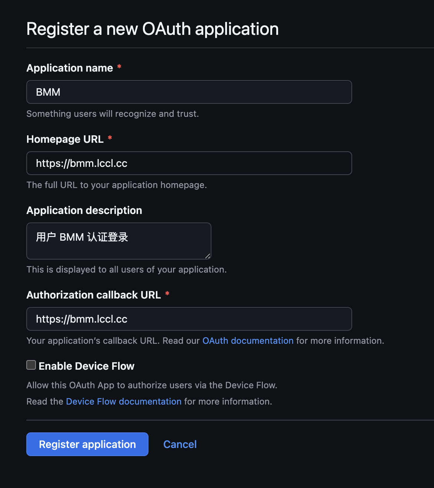
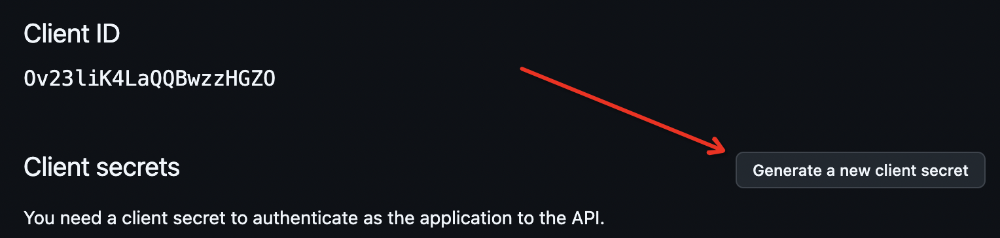
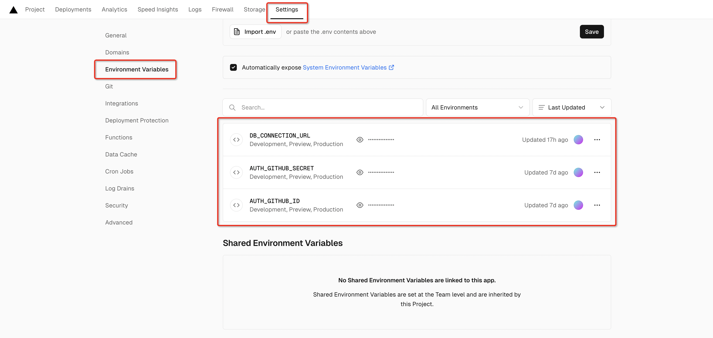
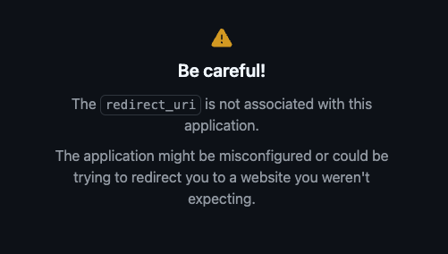
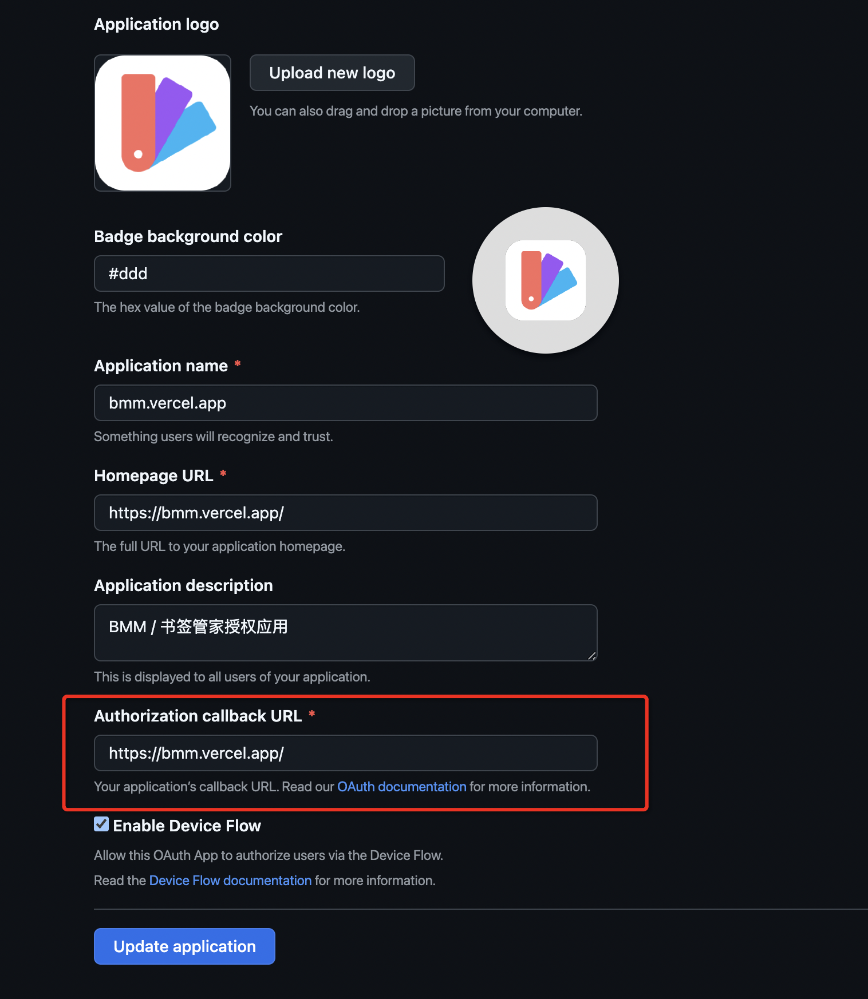

<div align="center">
  
  <br>
  <h3 style="font-size: 30px">BMM</h3>
  <p>收纳、分享、探索优质网站</p>
  <i>BMM / bookmark master / 你的专属书签管家</i>
</div>

## 功能

- [x] 书签关键词搜索
- [x] 根据标签筛选书签
- [x] 标签过滤
- [x] 首页样式兼容移动端、桌面端

后台管理功能：

- [x] Github 授权登录
- [x] 导入浏览器导出的书签
- [x] 标签、书签的增删改查
- [x] 标签间的相互关联
- [x] 标签和书签的相互关联
- [x] 标签排序
- [x] 爬取网站标题、图标、简介
- [x] AI 解析网站标题、图标、简介、关联标签
- [x] AI 为标签关联标签
- [x] 多个 API 自动获取网站图标

待实现：

- [ ] 定期检测书签可用性
- [ ] 书签置顶
- [ ] 稍后阅读系统
- [ ] 用户系统

## 目录

- [准备工作](xxx) 
- [项目部署](xxx)

## 准备工作

主要需要准备的内容包括数据库和 Github OAuth APP 配置。下面分别介绍。

### 数据库

BMM 通过 `drizzle-orm` 将数据存在 PostgreSQL 数据库中。因此需要准备一个 PostgreSQL 的数据库连接 URL。

如果使用 Docker 部署当前项目，数据库连接 URL 是可选的。如果没有提供，将会在内部启用一个 PostgreSQL 服务。

如果你已经有数据库服务，创建一个新的数据库然后拿到连接 URL 即可。

如果没有，这里有一些获取免费 PostgreSQL 云服务的方式：[查看](https://juejin.cn/post/7411047482651951119)。

**数据库连接 URL 将用于项目中的环境变量 `DB_CONNECTION_URL`。**

### Github OAuth App

BMM 使用 Github 授权登录，因此需要一个 Github OAuth APP 。

<details>
  <summary>
  查看创建步骤
  </summary>

1. 访问 https://github.com/settings/applications/new

2. 依次填写表单内容



其中最重要的是 `Authorization callback URL` 这一项，请保证它和你的项目最终部署的线上地址一致！

3. 创建一个 Client secret



</details>

**Github OAuth APP 的 Client ID 和 Client Secret 将分别用作环境变量 `AUTH_GITHUB_ID` 和 `AUTH_GITHUB_SECRET`，填写的 Authorization callback URL 将用作环境变量 `AUTH_URL`。**

## 项目部署

### 方式一: git 拉取部署

1. git clone 项目

```sh
git clone https://github.com/Y80/bmm.git
```

2. **.env** 文件中配置 `DB_CONNECTION_URL`

3. `pnpm install` 安装依赖

4. `pnpm dev` 启动项目

对于开发环境，`AUTH_URL` 可以被自动侦测到，`AUTH_GITHUB_ID` 和 `AUTH_GITHUB_SECRET` 也有一对可用的配置，因此无需配置。

通过 `pnpm build` 构建生产产物时，需要明确配置 `AUTH_URL`、`AUTH_GITHUB_ID` 和 `AUTH_GITHUB_SECRET`。（建议放在 **.env.production** 文件中）


### 方式二：部署至 Vercel

1. fork 当前 Github 仓库

2. 登入 <a href="https://vercel.com" target="_blank">Vercel</a>，新建项目，并关联 fork 的项目

3. 在当前项目下的 Environment Variables 页面中配置环境变量：
`DB_CONNECTION_URL`、`AUTH_URL`、`AUTH_GITHUB_SECRET` 和 `AUTH_GITHUB_ID`。

<details>
  <summary>查看截图</summary>
  
  
</details>


4. 在 Deployments 面板再重新部署一下即可

### 方式三：使用 Docker 部署

使用这种方式部署时，必须提供 Github OAuth 密钥对，而对于 PostgreSQL 数据库连接 URL 有没有都行。

## 接入 AI 服务

本项目通过 AI 实现了 **分析总结网站、给网站打标签、分析相关联的标签** 的功能，可大大减少维护书签数据的工作量。

由于目前 AI 服务商众多，且不同服务商提供的 API 并不相同，因此这里会有轻微的编码工作。

下面是使用 [字节跳动-扣子](https://www.coze.cn/docs/developer_guides/coze_api_overview) AI 能力的示例：

```ts
export const getServer = coze

function coze() {
  if (!env.COZE_API_KEY || !env.COZE_BOT_ID) {
    throw new Error('请配置环境变量 COZE_API_KEY、COZE_BOT_ID')
  }
  return {
    responseContentPath: 'messages[0].content',
    sendRequest(query: string) {
      return commonFetch({
        url: 'https://api.coze.cn/open_api/v2/chat',
        token: process.env.COZE_API_KEY!,
        body: {
          bot_id: process.env.COZE_BOT_ID,
          user: 'user',
          query,
          stream: false,
        },
      })
    },
  }
}
```

`src/lib/ai/servers.ts` 文件提供了使用 **扣子** 和 **OpenAI** 的代码示例可供参考。

> 配置环境变量注意敏感数据泄露！更多内容可参考 [.env](./.env)

## 常见问题

<details>
  <summary>
    Github 登录失败：redirect_uri 错误
  </summary>

如果在 Github 授权之后出现如下错误提示：



这表示授权之后 Github 需要跳转的地址和 [Github:OAuth Apps](https://github.com/settings/developers) 中的配置不一致。

**请保证下方配置的 Authorization callback URL 和你部署的域名一致。**



</details>

<br>

<details>
  <summary>
    支持其他数据库吗？
  </summary>

  由于 `drizzle-orm` 除了支持 PostgreSQL，还支持 MySQL 和 Sqlite，因此对项目做少许编码改造，即可切换数据库。
</details>
