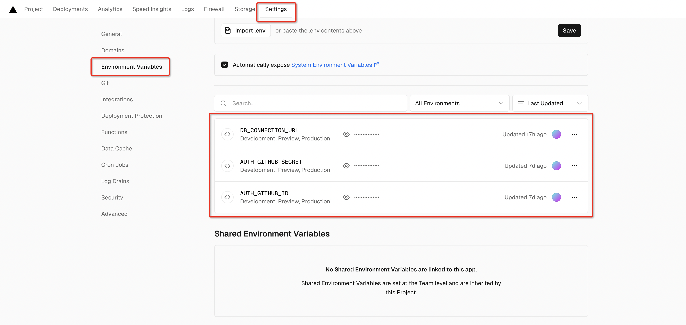
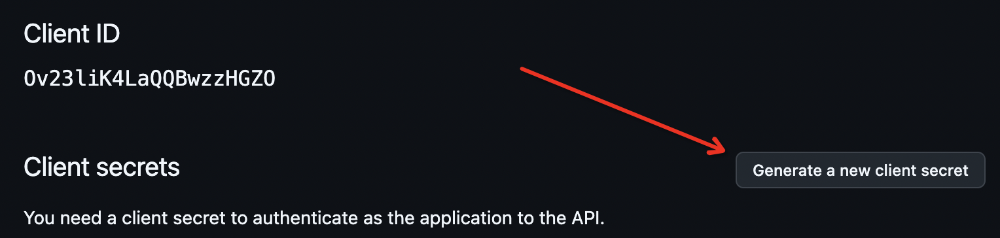

<div align="center">
  
  <br>
  <h1>BMM</h1>
  <p>收纳、分享、探索优质网站</p>
  <p><i>Bookmark Manager - 你的专属书签管家</i></p>
  <p>
    <a href="./README.en.md">🌐 English</a> •
    <a href="https://bmm.lccl.cc/" target="_blank">✨ 在线体验</a> •
    <a href="https://github.com/Y80/bmm" target="_blank">📦 GitHub</a> •
    <a href="#快速开始">🚀 快速开始</a>
  </p>
  <p>
    
    
    
    
    
  </p>
</div>

---

<div align="center">
  
  
  
  
</div>

---

## 📋 目录

- [✨ 功能特性](#-功能特性)
- [🛠️ 技术栈](#️-技术栈)
- [🚀 快速开始](#-快速开始)
- [⚙️ 环境变量](#️-环境变量)
- [🗄️ 数据库配置](#️-数据库配置)
- [🌍 项目部署](#-项目部署)
- [🤖 AI 集成](#-ai-集成)
- [🔐 GitHub OAuth 配置](#-github-oauth-配置)
- [❓ 常见问题](#-常见问题)
- [📄 许可证](#-许可证)

---

## ✨ 功能特性

### 基础功能

| 功能 | 描述 |
|------|------|
| 📱 响应式设计 | 支持移动端/桌面端、明亮/暗黑主题 |
| 🔍 智能搜索 | 支持书签、标签的拼音和关键词搜索 |
| 🏷️ 标签关联 | 标签间、书签与标签间的多对多关联 |
| 🔐 认证系统 | GitHub OAuth + 邮箱/密码双登录方式 |
| 👤 用户管理 | 登录用户可管理自己的书签和标签 |

### 后台管理功能

- 📥 **批量导入** - 导入浏览器导出的书签文件 (HTML/JSON)
- 📝 **CRUD 操作** - 标签、书签的增删改查
- 🔗 **标签关联** - 标签间的相互关联管理
- 📊 **标签排序** - 拖拽式标签排序
- 🕷️ **元数据抓取** - 自动爬取网站标题、图标、简介
- 🖼️ **书签图标增强** - 支持站点常见图标路径探测，并可在弹窗中维护第三方图标 API 列表（本地保存、拖拽排序、恢复默认）
- 🤖 **AI 智能解析** - AI 自动提取网站信息并推荐标签
- 🎨 **主题生成** - AI 为标签分析关联标签和主题色

### 待实现功能

- [ ] 多功能卡片（天气、资讯等）
- [ ] 浏览器扩展插件
- [ ] 书签可用性检测
- [ ] 稍后阅读系统

---

## 🛠️ 技术栈

| 类别 | 技术 |
|------|------|
| 框架 | [Next.js 16](https://nextjs.org/) (App Router) |
| 语言 | [TypeScript 5](https://www.typescriptlang.org/) |
| 样式 | [Tailwind CSS 4](https://tailwindcss.com/) |
| UI 组件 | [HeroUI](https://heroui.com/) + [Ant Design](https://ant.design/) |
| ORM | [Drizzle ORM](https://orm.drizzle.team/) |
| 数据库 | SQLite / PostgreSQL / Turso |
| 认证 | [NextAuth v5](https://authjs.dev/) |
| AI SDK | [Vercel AI SDK](https://sdk.vercel.ai/) |
| 测试 | [Vitest](https://vitest.dev/) |

---

## 🚀 快速开始

### 环境要求

- [Node.js](https://nodejs.org/) >= 24.0.0
- [pnpm](https://pnpm.io/) >= 10.24.0

### 本地开发

```bash
# 1. 克隆项目
git clone https://github.com/Y80/bmm.git
cd bmm

# 2. 安装依赖
pnpm install

# 3. 启动开发服务器
pnpm dev
```

项目将在 `http://localhost:3000` 启动，并自动创建 SQLite 数据库文件。

---

## ⚙️ 环境变量

详见 [.env](./.env) 文件。

### 快速体验

本地开发无需修改任何环境变量，使用默认 SQLite 配置即可。

### 生产部署

重点关注以下变量：

| 变量 | 说明 |
|------|------|
| `AUTH_URL` | 认证回调地址，必须与部署地址一致 |
| `DB_DRIVER` | 数据库驱动 (sqlite/postgresql) |
| `DB_CONNECTION_URL` | 数据库连接字符串 |
| `DB_AUTH_TOKEN` | Turso 数据库令牌（可选） |

---

## 🗄️ 数据库配置

BMM 使用 Drizzle ORM，开箱即用支持 SQLite 和 PostgreSQL。

### 默认配置（SQLite）

```bash
# 本地自动创建数据库文件
pnpm dev
```

### 线上数据库

#### 方案一：Turso（推荐）

- [BMM 接入 Turso 指南](https://github.com/Y80/bmm/wiki/使用-Turso-数据库服务)

#### 方案二：免费 PostgreSQL

- [一些免费的 PostgreSQL 数据库](https://juejin.cn/post/7411047482651951119)

---

## 🌍 项目部署

### 方式一：Node 项目常规部署

```bash
# 1. 克隆项目
git clone https://github.com/Y80/bmm.git
cd bmm

# 2. 安装依赖
pnpm install

# 3. 构建项目
pnpm build

# 4. 启动（或使用 PM2）
pnpm start
# 或
pm2 start "pnpm start"
```

### 方式二：部署至 Vercel

1. **Fork** 本仓库到您的 GitHub 账户
2. 登录 [Vercel](https://vercel.com)，新建项目并关联 Fork 的仓库
3. 在 Environment Variables 页面配置环境变量

   <details>
   <summary>查看截图</summary>

   

   **注意**：Vercel 自动分配的域名可免配 `AUTH_URL`
   </details>

4. 在 Deployments 面板重新部署即可

### 方式三：使用 Docker 部署

```bash
# 拉取镜像
docker pull lcclcc/bmm

# 启动容器（SQLite 模式，通过 docker volume bmm 查看数据库文件地址）
docker run --rm \
  -e DB_DRIVER=sqlite \
  -e DB_CONNECTION_URL=file:/app/volume/sqlite.db \
  -v bmm:/app/volume \
  -p 3000:3000 \
  lcclcc/bmm \
  pnpm start

# 启动容器（Turso 模式）
docker run --rm \
  -e DB_DRIVER=sqlite \
  -e DB_CONNECTION_URL=libsql://Turso数据库地址 \
  -e DB_AUTH_TOKEN=<Turso数据库令牌> \
  -p 3000:3000 \
  lcclcc/bmm \
  pnpm start

# 启动容器（PostgreSQL 模式）
docker run --rm \
  -e DB_DRIVER=postgresql \
  -e DB_CONNECTION_URL=postgresql://数据库地址 \
  -p 3000:3000 \
  lcclcc/bmm \
  pnpm start
```

---

## 🤖 AI 集成

AI 功能可大幅减少维护书签的工作量：

- 📝 **网站分析** - 自动提取标题、描述、图标
- 🏷️ **智能标签** - 自动推荐相关标签
- 🎨 **主题生成** - 分析标签关联和主题色

### 支持的 AI 服务

本项目支持所有 OpenAI 接口标准的服务：

- [OpenAI](https://openai.com/)
- [DeepSeek](https://www.deepseek.com/)
- [Moonshot (Kimi)](https://www.moonshot.cn/)
- [GLM (智谱)](https://www.zhipuai.cn/)
- ......

### 配置示例

在 `.env` 文件中添加：

```bash
# 示例：接入 DeepSeek
OPENAI_API_KEY=sk-xxxxxxxxxxxxxxxx
OPENAI_BASE_URL=https://api.deepseek.com/v1
OPENAI_MODEL=deepseek-chat
```

对于其它不兼容 OpenAI API 标准的服务（如 Gemini / Anthropic 等），可参考 [AI SDK Providers](https://ai-sdk.dev/providers/ai-sdk-providers) 接入。

---

## 🔐 GitHub OAuth 配置

### 创建 OAuth App

1. 登录 GitHub 账户，访问 https://github.com/settings/applications/new
2. 填写表单内容

   

   **重要**：`Authorization callback URL` 必须与部署地址一致！

3. 创建 Client secret

   

### 环境变量

```bash
AUTH_GITHUB_ID=your-client-id
AUTH_GITHUB_SECRET=your-client-secret
AUTH_URL=https://your-domain.com  # 必须与 callback URL 一致
```

---

## ❓ 常见问题

<details>
<summary>
如何设置 <code>AUTH_URL</code> 和 GitHub Authorization callback URL？
</summary>

<br>

`AUTH_URL` 和 GitHub OAuth App 中的 Authorization callback URL 必须一致，等于您访问 BMM 的地址：

- `http://localhost:3000` - 本地开发
- `https://bmm.vercel.app` - Vercel 默认域名
- `https://example.com` - 自定义域名
- `http://10.1.2.3:3000` - IP 直接访问

</details>

<details>
<summary>
Github 登录失败：redirect_uri 错误
</summary>

<br>

错误提示：


**解决方案**：确保 GitHub OAuth App 中的 `Authorization callback URL` 与 `AUTH_URL` 和访问域名一致。


</details>

<details>
<summary>
修改端口后回调地址有误
</summary>

<br>

如果您修改了项目端口并通过 `http://{IP}:{PORT}` 访问，需要同步修改 `AUTH_URL`。

**原则**：访问地址 = Authorization callback URL = `AUTH_URL`

</details>

<details>
<summary>
支持其他数据库吗？
</summary>

<br>

借助 Drizzle ORM，可快速接入 MySQL 等数据库。

</details>

---

## 📄 许可证

本项目采用 [MIT](./LICENSE) 许可证。

---

## 🤝 贡献

欢迎提交 Issue 和 Pull Request！

---

<div align="center">
  <p>Made with ❤️ by <a href="https://github.com/Y80">Y80</a></p>
  <p>如果这个项目对您有帮助，请给个 ⭐ Star！</p>
</div>
